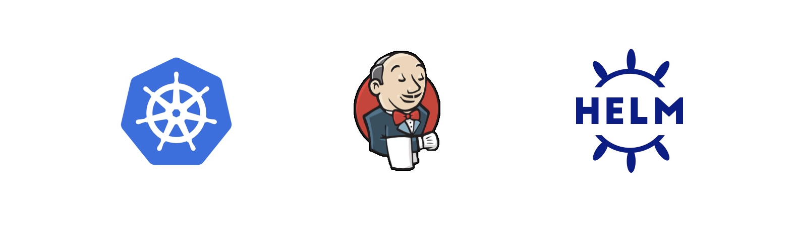

## Scenario Overview

In this tutorial, you will learn how to install a containerized version of [Jenkins](https://www.jenkins.io/) in [Kubernetes](https://kubernetes.io/) using [Helm](https://helm.sh/). Especifically, we will install and upgrade a [Jenkins controller](https://www.jenkins.io/doc/book/glossary/#general-terms) from its public [Helm chart](https://github.com/jenkinsci/helm-charts/tree/main/charts/jenkins). 

## Technologies 

1. Kubernetes, also known as K8s, is an open-source system for automating deployment, scaling, and management of containerized applications. Learn more about Kubernetes and its advantages in [this link](https://kubernetes.io/docs/concepts/overview/what-is-kubernetes/).

2. Helm is the Kubernetes native package manager, it allows to install and manage applications in Kubernetes without the need to manage and configure multiple resource files . 

3. Finally, Jenkins (the application we will be installing) is a widely used automation tool that can leverage Kubernetes to deploy other containers (called [agents](https://www.jenkins.io/doc/book/using/using-agents/)) and run tasks in them (usually focused on building, testing and deploying other applications).

Jenkins is composed of Kubernetes resources such as:

**[StatefulSet](https://kubernetes.io/docs/concepts/workloads/controllers/statefulset/)** - manages the deployment and scaling of a set of Pods(smallest deployable units of computing that you can create and manage in Kubernetes, a pod contains one or more containers).

**[Service](https://kubernetes.io/docs/concepts/services-networking/service/)** - An abstract way to expose an application running on a set of Pods as a network service. This will allows us to access Jenkins.

## Why using Helm?

**Usually applications in K8s are composed of deployments, services, secrets, persistent volumes, etc that are configured using multiple YAML files ([deploying mySQL without Helm](https://kubernetes.io/docs/tasks/run-application/run-single-instance-stateful-application/)). One of Helm's intent is to provide a level of abstraction on top of these resources to facilitate application management (installation, deployment in multiple environment, upgrade, etc). In our case, Jenkins k8s components (statefulSet and service) will be managed by Helm. ** 

## [Overall usage of Helm](https://helm.sh/docs/topics/architecture/)

Helm is a tool for managing Kubernetes packages called **charts**. Helm can do the following:

* Create new charts from scratch (next scenario)
* Package charts into chart archive (tgz) files (next scenario)
* **Interact with chart repositories where charts are stored (in this scenario)**
* **Install and uninstall charts into an existing Kubernetes cluster (in this scenario)**
* **Manage the release cycle of charts that have been installed with Helm (in this scenario)**

For Helm, there are three important concepts:

* The chart is a bundle of information necessary to create an instance of a Kubernetes application.
* The config contains configuration information that can be merged into a packaged chart to create a releasable object.
* A release is a running instance of a chart, combined with a specific config.

## Prerequisites

1. Familiarity with the terminal and have some previous experience with containers.

## Learning Objectives

1. Understand what Helm is and its role in Kubernetes.
2. Become familiar with the Helm client using the terminal and obtain useful application information.
3. Learn the necessary Helm client commands to inspect, install, and upgrade a Helm public chart.
4. Learn how to verify an application is installed when using Helm.
5. Inspect all k8s resources installed that are part of Jenkins.

