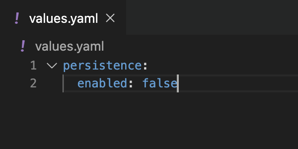
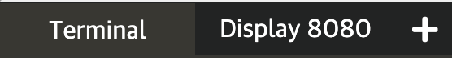

**Answer**: The correct command to install an application is `helm install`

One of the available options to configure our chart is to set the **application storage** to **false**. In fact, this is needed since our ephemeral working environment in Katacoda does not offer a persistent volume (used to save state in case the pod needs to be restarted) and it will cause an error in our installation. 

In order to do that, we need to change the `persistent` option to `false`. You can locate this option  **in or around line 707** in `values.yaml`:

```
persistence:
  enabled: true
```

### Installation alternatives:

There are two ways we can customize the installation of the Jenkins chart with this option. 

**One option is to pass different values in the command line:**

`helm install jenkins jenkins/jenkins -n jenkins --version 3.3.21 --set persistence.enabled=false --dry-run | less`{{execute}}

Let's analyze the command above:

The first `jenkins` after `helm install` is the name we are going to give to our application.

`jenkins/jenkins` is the name of the repo and the name of the chart we want to install from that repo. 

`-n jenkins` is the namespace where we are going to install the application (created in the previous step). 

`--version` is the chart version. 

`--set persistence.enabled=false` is the option we are setting for the chart.

`--dry-run` is to see the files we are going to create when we execute the command but not apply the changes yet.

**Another option is to pass the `values.yaml` file with the desired options (this is usually the preferred method as the file can be saved in version control).** 

Go to the `values.yaml` file we created in VSCode and delete everything. **Yes, delete everything and copy and paste the snippet below.** Helm will only change the persistent option to false and deploy all the rest of **default** options:

```
persistence:
  enabled: false
```{{copy}}



Now let's use a similar command to the first option that allows us to pass a file using the flag `-f` instead of `--set` (still with `--dry-run` as we are not installing yet and we just want to validate the file has no errors!):

`helm install jenkins jenkins/jenkins -n jenkins --version 3.3.21 -f values.yaml --dry-run | less`{{execute}}


### Side note: A trick for when you don't have Helm in all machines

**Did you notice how you were able to see all the resources that were going to be created in Kubernetes when you added the `--dry-run` command (pod, secret, ConfigMap, etc)?**

An easier way to see the actual resources as if you were using YAML is to use `helm template`. This command can give you one file (i.e `resources.yaml`) with all the components needed to install the application. 

`helm template jenkins jenkins/jenkins -n jenkins --version 3.3.21 -f values.yaml > resources.yaml`{{execute}}

Take a look at the `resources.yaml` file in VSCode and see all the resources that Helm will install for you. This is useful in cases where the Helm client is no available in the machine that has access your Kubernetes cluster. 

You can install Helm in any a development machine, use `helm template` to create a single file with all the resources for the application and install it by just using `kubectl apply -f resources.yaml`.


### Going back to our installation with `values.yaml` file:

In our case, we don't need `helm template` as we have Helm access so let's install Jenkins with the `values.yaml` file:

`helm install jenkins jenkins/jenkins -n jenkins --version 3.3.21 -f values.yaml`{{execute}}

Take a look at the information provided after running this command (in this case it contains the command to get the password for the UI). This information is also available running:

`helm status jenkins -n jenkins`{{execute}}

### Verifying application is running:

See if the Jenkins pod is running:

`kubectl get pods -n jenkins -w`{{execute}} (`-w` to follow but it is optional)

Press `Control+C` to exit once the pod `Status` is `Running`. It should take a few minutes. Taking too long? Debug with `kubectl describe pods -n jenkins` and look at the messages at the bottom. Sometimes it takes a bit to download the image.


### Accesing the Jenkins UI:

Execute the following command to get your console password (it was also displayed as `Step 1` in the `helm status` message):

`kubectl exec --namespace jenkins -it svc/jenkins -c jenkins -- /bin/cat /run/secrets/chart-admin-password && echo`{{execute}}

Now, `port-forward` the console so you can see it in your browser (the command is a bit different for our environment than the one provided by `helm status`):

`kubectl port-forward jenkins-0 8080:8080 --address 0.0.0.0 -n jenkins`{{execute}}

Click on `Display 8080` in the terminal options so it opens a new window:



Login with the user **admin** and the password you retrieved. **Notice in the bottom right that the application version is `Jenkins 2.277.4`.**

Go back to the terminal window and press `Control+C` to stop forwarding. 

### Question:

**What command do you think you can use to see all the applications installed using Helm?**
Always use `helm -h` when in doubt.

Click on `Continue` to see the correct answer.
