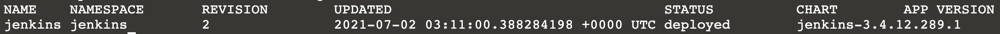

`helm list` displays the applications installed using Helm.

Run helm list again to see the deployed application:

`helm list --all-namespaces`{{execute}}

Now, lets upgrade to the version `3.4.1` with the same parameters (you can also execute `--dry-run` to test and `helm show values` to see new options):

`helm upgrade jenkins jenkins/jenkins -n jenkins --version 3.4.1 -f values.yaml`{{execute}}

Wait for the new pod to start running `kubectl get pods -n jenkins -w`{{execute}}. `Control + C` once pod is running.

Now double check that a new application was deployed:

`helm list --all-namespaces`{{execute}} should provide revision 2 for your application, 3.4.1 for your chart version and application version 2.289.1. 

Run `kubectl port-forward jenkins-0 8080:8080 --address 0.0.0.0 -n jenkins`{{execute}} to expose the application. Open a new window again by clicking `Display 8080`, login user the same `admin` username and the same password as before. You should be able to see that the application version in the bottom right is `Jenkins 2.289.1` now.

Now go to the part 2 of this tutorial to learn how to (create your own Helm chart)[https://katacoda.com/msuarez/scenarios/2-creating-a-helm-chart]

