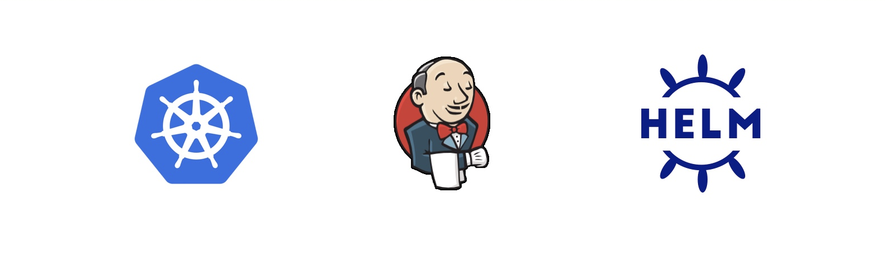

In this tutorial, you will learn how to install a containerized version of [Jenkins](https://www.jenkins.io/) in [Kubernetes](https://kubernetes.io/) using [Helm](https://helm.sh/). 
* Kubernetes, also known as K8s, is an open-source system for automating deployment, scaling, and management of containerized applications. 
* Helm is the Kubernetes native package manager, it allows to install and manage applications in Kubernetes without the need to deploy multiple resource files (YAML files). 
* Finally, Jenkins is a widely used automation tool that can leverage Kubernetes to deploy other containers (called [agents](https://www.jenkins.io/doc/book/using/using-agents/)) and run tasks in them (usually focused on building, testing and deploying other applications).

In this first scenario, we will learn:
* How to install and upgrade a [Jenkins controller](https://www.jenkins.io/doc/book/glossary/#general-terms) from its public [Helm chart](https://github.com/jenkinsci/helm-charts/tree/main/charts/jenkins).
* How to interact with the Helm client to obtain useful application information.

