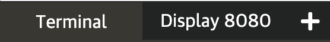

Now let's install Jenkins with the `values.yaml` file:

`helm install jenkins jenkins/jenkins -n jenkins --version 3.3.21 -f values.yaml`{{execute}}

Also, you can see if the pod is running:

`kubectl get pods -n jenkins -w`{{execute}}

Press `Control+C` to exit once the pod `Status` is `Running`. It should take around a minute. 

You can see the status and useful information of the Helm deployment (the same message that you just when you executed `helm install ...`) by running:

`helm status jenkins -n jenkins`{{execute}}

Copy the command to get your console password (Step 1 in the Helm status message):

`kubectl exec --namespace jenkins -it svc/jenkins -c jenkins -- /bin/cat /run/secrets/chart-admin-password && echo`{{execute}}

Now, `port-forward` the console so you can see it in your browser (the command is a bit different for our environment than the one provided by Helm status):

`kubectl port-forward jenkins-0 8080:8080 --address 0.0.0.0 -n jenkins`{{execute}}

Click on `Display 8080` in the terminal options so it opens a new window:

Login with the user **admin** and the password you retrieved. Notice in the bottom right that the application version is `Jenkins 2.277.4`. 

Go back to the terminal window and press `Control+C` to stop forwarding. Run helm list again to see the deployed application:

`helm list --all-namespaces`{{execute}}

Now, lets upgrade to the version `3.4.1` with the same parameters (you can also execute `--dry-run` to test and `helm show values` to see new options):

`helm upgrade jenkins jenkins/jenkins -n jenkins --version 3.4.1 -f values.yaml`{{execute}}

Wait for the new pod to start running. Now double check that a new application was deployed:

`helm list --all-namespaces`{{execute}} should provide revision 2 for your application, 3.4.1 for your chart version and application version 2.289.1. 

Once you login to the UI using `kubectl port-forward jenkins-0 8080:8080 --address 0.0.0.0 -n jenkins`{{execute}} to expose the application and open a new window, you should be able to see that the application version in the bottom right is `Jenkins 2.289.1`

