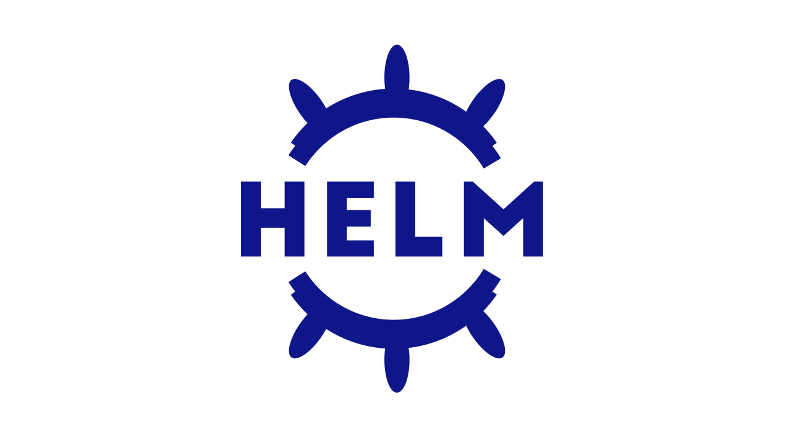

Helm is the Kubernetes native package manager, it allows to install and manage applications in Kubernetes without the need to deploy multiple resource files. 

In this first scenario, we will learn:
* How to install and upgrade [Jenkins](https://www.jenkins.io/) from its public [Helm chart](https://github.com/jenkinsci/helm-charts/tree/main/charts/jenkins).
* How to interact with the Helm client to obtain useful application information.

